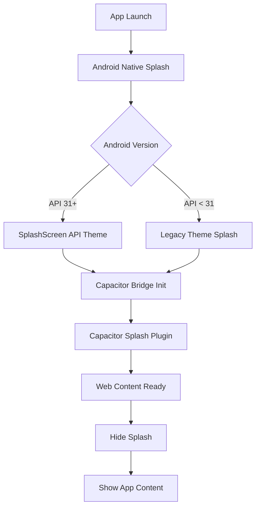
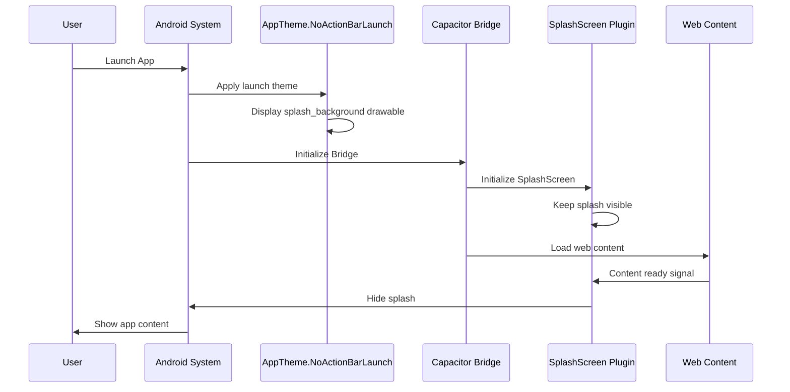

# Design Document: Splash Screen Fix for Tall Aspect Ratio Devices

## Overview

This design addresses the splash screen display issue on Android devices with tall aspect ratios (20:9 or taller). The current implementation uses a centered bitmap that doesn't scale properly on tall screens, resulting in blank areas or no splash display. The solution involves:

1. Installing and configuring `@capacitor/splash-screen` plugin for programmatic control
2. Restructuring splash drawable resources to use `fillXY` scaling with proper background
3. Creating density-specific splash images optimized for tall aspect ratios
4. Updating Android styles for proper edge-to-edge display

## Architecture



### Component Interaction



## Components and Interfaces

### 1. Capacitor Splash Screen Plugin

The `@capacitor/splash-screen` plugin provides programmatic control over splash screen visibility.

**Configuration Interface (capacitor.config.ts):**
```typescript
interface SplashScreenConfig {
  launchShowDuration: number;      // Time in ms to show splash (0 = wait for hide())
  launchAutoHide: boolean;         // Auto-hide after duration
  launchFadeOutDuration: number;   // Fade out animation duration
  backgroundColor: string;         // Background color (hex)
  androidSplashResourceName: string; // Custom drawable name
  androidScaleType: 'CENTER' | 'CENTER_CROP' | 'CENTER_INSIDE' | 'FIT_CENTER' | 'FIT_XY';
  showSpinner: boolean;            // Show loading spinner
  splashFullScreen: boolean;       // Full screen mode
  splashImmersive: boolean;        // Immersive mode (hide system bars)
}
```

### 2. Android Drawable Resources

**splash_background.xml (layer-list):**
```xml
<?xml version="1.0" encoding="utf-8"?>
<layer-list xmlns:android="http://schemas.android.com/apk/res/android">
    <!-- Solid background color fills entire screen -->
    <item android:drawable="@color/splashBackground" />
    
    <!-- Centered logo that maintains aspect ratio -->
    <item>
        <bitmap
            android:src="@drawable/splash"
            android:gravity="center" />
    </item>
</layer-list>
```

### 3. Android Theme Configuration

**styles.xml (values/):**
```xml
<style name="AppTheme.NoActionBarLaunch" parent="Theme.SplashScreen">
    <item name="android:windowBackground">@drawable/splash_background</item>
    <item name="windowSplashScreenBackground">@color/splashBackground</item>
    <item name="windowSplashScreenAnimatedIcon">@android:color/transparent</item>
    <item name="android:fitsSystemWindows">false</item>
    <item name="android:windowLayoutInDisplayCutoutMode">shortEdges</item>
    <item name="android:statusBarColor">@android:color/transparent</item>
    <item name="android:navigationBarColor">@android:color/transparent</item>
</style>
```

## Data Models

### Splash Image Specifications

| Density | Folder | Recommended Size | Aspect Ratio |
|---------|--------|------------------|--------------|
| **Fallback** | **drawable** | **1080x1920** | **Variable** |
| mdpi | drawable-port-mdpi | 320x480 | Variable |
| hdpi | drawable-port-hdpi | 480x800 | Variable |
| xhdpi | drawable-port-xhdpi | 720x1280 | Variable |
| xxhdpi | drawable-port-xxhdpi | 1080x1920 | Variable |
| xxxhdpi | drawable-port-xxxhdpi | 1440x2560 | Variable |

**Key Design Principle:** The splash image should have a solid background color that matches `splashBackground` color, with the logo/branding centered. This ensures that on tall devices, the background color seamlessly extends to fill any gaps.

**Fallback Image Strategy:** A universal splash image must be placed in the base `drawable` folder (not density-specific). This serves as a fallback when Android cannot find a matching density-specific image. The recommended size is 1080x1920 (xxhdpi equivalent) which provides good quality across most modern devices while keeping file size reasonable.

### Capacitor Configuration Model

```typescript
// capacitor.config.ts
const config: CapacitorConfig = {
  plugins: {
    SplashScreen: {
      launchShowDuration: 2000,
      launchAutoHide: true,
      launchFadeOutDuration: 300,
      backgroundColor: "#FFFFFF",
      androidScaleType: "CENTER_CROP",
      showSpinner: false,
      splashFullScreen: true,
      splashImmersive: true
    }
  }
};
```

## Correctness Properties

*A property is a characteristic or behavior that should hold true across all valid executions of a system—essentially, a formal statement about what the system should do. Properties serve as the bridge between human-readable specifications and machine-verifiable correctness guarantees.*

Based on the prework analysis, the splash screen requirements are primarily visual/UI requirements that cannot be automatically tested with property-based testing. The functionality involves:
- Native Android rendering
- Visual appearance across different screen sizes
- Platform-specific behavior (Android 12+ vs legacy)

**No testable properties identified for property-based testing.**

The splash screen functionality requires manual device testing or screenshot-based UI testing frameworks for verification. Testing should be performed on:
- Standard aspect ratio devices (16:9)
- Tall aspect ratio devices (20:9, 21:9)
- Devices with notches/cutouts
- Android 10, 11, 12, 13, and 14

## Error Handling

### Splash Screen Timeout

If web content fails to load within a reasonable time, the splash screen should still hide to prevent the app appearing frozen:

```typescript
// In main.tsx or App.tsx
import { SplashScreen } from '@capacitor/splash-screen';

// Fallback timeout to hide splash even if content isn't ready
setTimeout(() => {
  SplashScreen.hide();
}, 5000); // 5 second maximum
```

### Missing Drawable Resources

If splash drawable resources are missing, Android will fall back to the default app icon or a blank screen. The build process should validate that all required drawable resources exist.

### Android Version Compatibility

The design uses `Theme.SplashScreen` parent which requires the AndroidX SplashScreen library. For devices running Android 11 or below, the library provides backward compatibility.

## Testing Strategy

### Manual Testing Matrix

| Device Type | Android Version | Aspect Ratio | Test Focus |
|-------------|-----------------|--------------|------------|
| Standard phone | 10-11 | 16:9 | Legacy splash behavior |
| Tall phone | 12+ | 20:9 | Android 12 API + tall screen |
| Notched phone | 12+ | 19.5:9 | Cutout rendering |
| Tablet | 12+ | 16:10 | Wide aspect ratio |

### Test Cases

1. **Cold Start Test**: Launch app from killed state, verify splash displays immediately
2. **Tall Device Test**: Launch on 20:9+ device, verify no blank areas
3. **Transition Test**: Verify smooth transition from splash to app content
4. **Duration Test**: Verify splash displays for minimum 2000ms
5. **Edge-to-Edge Test**: Verify splash extends behind system bars
6. **Notch Test**: Verify splash renders into cutout area

### Unit Tests

Unit tests are not applicable for this feature as it involves native Android rendering and visual appearance. Integration testing on actual devices is required.

### Property-Based Tests

No property-based tests are applicable for this feature. The requirements are visual/UI requirements that require manual verification or screenshot-based testing.
